# 技術仕様書

## **1. 概要**

本仕様書は、Webアプリケーション「日帰り地図帳」の技術的な設計を包括的に定義するものです。システムアーキテクチャ、技術選定の意思決定、およびデータベース設計を含みます。

本設計は、迅速なMVP（実用最小限の製品）開発と、AIによる「ディープ・パーソナライゼーション」を核とする将来の高度な機能拡張の両立を目的とします。

---

## **2. ユビキタス言語集**

本セクションでは、プロジェクト全体（ビジネス、開発、ドキュメント）で使用する主要な用語を定義し、用語の一貫性を確保します。

| 用語 (日本語) | 用語 (英語 / コード上の名称) | 定義 | 主な役割・文脈 |
| --- | --- | --- | --- |
| **スポット** | **Spot** (`spots`) | 地理的・情報の最小単位。観光地点のマスターデータ。 | `モデルプラン` を構成する具体的な地点（例: 鶴岡八幡宮）として、詳細ページに表示される。 |
| **クラスター** | **Cluster** (`clusters`) | 複数の`spots`をグループ化した観光地域（例: 鎌倉、箱根）のマスターデータ。 | AIによる提案結果の単位。「提案アイテム」が指し示す実体（例: "鎌倉エリア"）。 |
| **(匿名) セッション** | **Session** (`session_id`) | 会員登録不要のユーザーを識別するためのID。`suggestion_sets` や `user_action_logs` で使用される。 | 匿名ユーザーの体験フロー全体を管理し、`suggestion_sets` とユーザーを紐付けるために使われる。 |
| **提案セット** | **Suggestion Set** (`suggestion_sets`) | 1回の検索リクエスト（提案セッション）そのもの。 | ユーザーが「出発地」を入力して開始した、1回の提案フロー全体を管理する。提案待機ページ（進捗表示）のステータス管理の主体。 |
| **提案アイテム** | **Suggestion Set Item** (`suggestion_set_items`) | 提案セットに含まれる個別の旅行先（`cluster`）を管理する。 | 提案結果一覧ページにカードとして表示される個別の項目（例: "鎌倉プラン" カード）。`クラスター`、`キービジュアル`、`キャッチコピー`、`モデルプラン`を紐付ける役割。 |
| **モデルプラン** | **Model Plan** (`model_plans`) | 観光地域（`cluster`）ごとのモデルプランのヘッダー情報（プラン名、概要など）。 | 詳細ページで提示されるタイムライン形式のプランの「概要」部分（例: "鎌倉王道 満喫プラン"）。 |
| **モデルプラン・アイテム** | **Model Plan Item** (`model_plan_items`) | モデルプランを構成する個々のステップ（スポット訪問や移動）を時系列で管理する。 | 詳細ページのタイムラインで「1. 鶴岡八幡宮 (滞在60分)」や「→ (徒歩15分)」といった具体的なステップを表示するために使われる。 |
| **キャッチコピー** | **Catchphrase** (`catchphrases`) | AIによって生成されたパーソナライズド・キャッチコピー。 | `提案アイテム` の一部として、提案結果一覧カードに表示され、ユーザーの心に響かせる（"自分ごと化"）役割を担う。 |
| **キービジュアル** | **Key Visual** (`images`) | `提案アイテム` ごとに設定される、最も魅力的な画像。`images` テーブルで管理される。 | 提案結果一覧カードのメイン画像として表示され、ユーザーの直感的な興味を引く役割を担う。 |
| **出発地** | **Input Location** (または `origin`) | ユーザーが検索時に入力する緯度・経度。`suggestion_sets` に記録される。 | トップページでユーザーが入力する情報。AIが提案（移動時間の計算など）を行うための基準点となる。 |

---

## **3. システムアーキテクチャ**

### **3.1. アーキテクチャ概要**

- **アーキテクチャパターン:** 開発速度を優先するMVPフェーズでは`Laravel` + `Inertia.js` + `React`のモノリシック構成を採用。将来的にAI機能を強化するフェーズで、`FastAPI`(Python)によるAIエンジンをマイクロサービスとして分離する段階的アプローチを採る。
- **データベース:** `PostgreSQL` + `PostGIS`を採用。スポット情報を最小単位とする「スポット中心アプローチ」で、柔軟なデータ構造を実現。
- **テスト:** MVPフェーズの単体テストにはPestを使用。それ以外は未定。
- **非同期処理:** Laravelのキューシステムを使用し、重い処理（AI API呼び出し、データ生成など）をバックグラウンドジョブとして実行。

### **3.2. C4モデル図**

#### **3.2.1. Level 1: System Context（システム文脈図）**

Level 1 は、`日帰り地図帳システム` がどのような外部アクターや外部システムと相互作用するかを示します。

**アクター (Actor):**
- **ユーザー (匿名):** メインの利用者。会員登録なしでサービスを利用します。

**外部システム (External Systems):**
- **GPS (ブラウザ):** ユーザーの現在地を取得するために使用します。
- **Google Places API:** 出発地入力のサジェストと座標特定に使用します。
- **AI (Gemini API):** スポット情報の収集や、パーソナライズされた提案（キャッチコピー、モデルプラン）の生成に使用します。
- **アフィリエイト先 (例: アソビュー！):** 収益源として、アクティビティ予約サイトへ送客します。

```mermaid
C4Context
    title システム文脈図 (C4 Level 1) - 日帰り地図帳

    Actor(user, "ユーザー (匿名)", "日帰り旅行先を探している人")

    System_Ext(gps, "GPS (ブラウザ)", "デバイスの現在地情報")
    System_Ext(google_places, "Google Places API", "地名検索サジェスト/座標特定")
    System_Ext(ai_api, "AI (Gemini API)", "スポット収集・提案生成")
    System_Ext(affiliate, "アフィリエイト先", "例: アソビュー！")

    System(daytrip_atlas, "日帰り地図帳システム", "Laravel + Inertia.js + Reactによるモノリシック構成")

    ' ユーザーからのリクエスト
    Rel(user, daytrip_atlas, "1. 出発地を入力し提案をリクエストする")
    Rel(user, gps, "現在地を利用する")
    Rel(gps, daytrip_atlas, "現在地の緯度経度を渡す")
    Rel(daytrip_atlas, google_places, "地名入力のサジェストを要求")
    Rel(google_places, daytrip_atlas, "サジェスト結果を返す")

    ' システムの内部処理 (外部連携)
    Rel(daytrip_atlas, ai_api, "2. AIに提案生成を要求する (非同期)")
    Rel(ai_api, daytrip_atlas, "生成結果を返す")

    ' ユーザーへの結果表示と送客
    Rel(daytrip_atlas, user, "3. 提案結果（モデルプラン等）を表示する")
    Rel(user, daytrip_atlas, "4. 詳細ページのリンクをクリックする")
    Rel(daytrip_atlas, affiliate, "5. アフィリエイト先へ送客する")
```

#### **3.2.2. Level 2: Containers（コンテナ図）**

Level 2 は、`日帰り地図帳システム` の内部構成要素（コンテナ）を示します。MVPフェーズでは、開発速度を優先したモノリシック構成を採用します。

**コンテナ (Containers):**
- **Web Application:** ユーザーのリクエストを受け付け、Inertia.js を介してReactコンポーネントを描画するメインアプリケーションです。提案リクエストの受付と、キューへのジョブ登録も担当します。
- **Job Worker:** キューを監視し、重い処理（AI APIコール、DBへのデータ構築など）を非同期で実行するバックグラウンドプロセスです。
- **Queue:** Web Application と Job Worker を疎結合にするためのキューシステムです。非同期処理の「こだわりポイント」として明示されます。
- **Database:** 全てのマスターデータ、ユーザーセッション、提案結果を格納するデータベースです。PostGISによる地理空間クエリ機能が必須となります。

```mermaid
C4Container
    title コンテナ図 (C4 Level 2) - 日帰り地図帳

    Actor(user, "ユーザー (匿名)", "Webブラウザ経由でアクセス")

    System_Ext(ai_api, "AI (Gemini API)", "提案生成")
    System_Ext(google_places, "Google Places API", "地名検索")

    System_Boundary(mvp_system, "日帰り地図帳システム") {
        Container(web_app, "Web Application", "Laravel (PHP)", "ユーザーのリクエスト処理 (HTTP)、Inertia.jsでのReact描画、ジョブのキューイング")
        Container(job_worker, "Job Worker", "Laravel (PHP)", "キューを監視し、非同期で重い処理（AIコール、DB書き込み）を実行")
        Container(queue, "Queue", "Redis / DB", "Web AppとJob Workerを疎結合にするメッセージキュー")
        ContainerDb(database, "Database", "PostgreSQL + PostGIS", "スポット、クラスター、提案セット、モデルプラン等のデータを格納")
    }

    ' ユーザーからのリクエストフロー (同期)
    Rel(user, web_app, "1. 提案リクエスト (HTTPS)")
    Rel(web_app, google_places, "地名サジェストを要求 (API)")
    Rel(web_app, user, "2. 提案待機ページを即時返却 (Inertia/HTTPS)")
    Rel(user, web_app, "3. 進捗ポーリング (HTTPS)")
    Rel(web_app, database, "提案ステータスを読み取り (SQL)")
    Rel(database, web_app, "ステータスを返す (SQL)")
    Rel(web_app, user, "4. 進捗/結果を返却 (Inertia/HTTPS)")

    ' バックグラウンド処理フロー (非同期)
    Rel(web_app, queue, "1a. 提案生成ジョブを登録 (Enqueue)")
    Rel(queue, job_worker, "2a. ジョブを取得 (Dequeue)")
    Rel(job_worker, ai_api, "3a. スポット収集・プラン生成を要求 (API Call)")
    Rel(ai_api, job_worker, "4a. 生成結果を返す")
    Rel(job_worker, database, "5a. 提案結果 (suggestion_set_items, etc.) をDBに保存 (SQL)")
```

---

## **4. アーキテクチャ決定記録 (ADRs)**

本セクションでは、重要な技術的「意思決定」の背景、理由、およびその結果（トレードオフ）を記録します。

### **4.1. ADR-001: MVPのモノリシック構成（Inertia.js）採用**

**ステータス:** Accepted

**背景 (Context):**
- MVP開発期間は極めて迅速な開発が求められている（〜2週間）。
- 将来的な構想として、AIエンジン（`FastAPI`）のマイクロサービス分離も言及されているが、これはMVPのスコープ外である。

**決定 (Decision):**
- MVP開発フェーズにおいては、API（バックエンド）とフロントエンドを分離せず、`Inertia.js` を利用したモノリシック（密結合）アーキテクチャを採用する。

**論拠 (Rationale):**
- **開発速度の最大化:** 従来のSPA + JSON API構成と比較し、APIのエンドポイント設計、スキーマ定義、認証（例: JWT/Sanctum）、CORS設定などの工数を大幅に削減できる。
- **型定義の不整合リスク低減:** ページプロパティ定義のPropsの「契約」に集中でき、バックエンド（リソースクラス）とフロントエンド（TypeScript型）の同期が比較的容易である。
- **チーム体制:** 現在は企画・開発を兼任する1名体制であり、責務が分離された複数チーム間での開発（API分離構成のメリット）は不要である。

**結果・影響 (Consequences):**
- **メリット:** MVPのコア体験の実装に最速で集中できる。
- **デメリット（トレードオフ）:**
    - 将来的にマイクロサービス化や、Webフロントエンド以外のクライアント（例: スマートフォンアプリ）を開発する際には、APIを別途構築する必要があり、`Inertia.js` で実装したロジックの一部（コントローラやリソースクラス）は改修または再利用が困難になる可能性がある。

### **4.2. ADR-002: PostGISの採用**

**ステータス:** Accepted

**背景 (Context):**
- ユーザーは「出発地」を入力し、そこからの距離や移動時間が提案の重要な要素となる。
- データ基盤構築戦略において、スポットベースのクラスタ再構築では、地理空間クエリ（例：特定の範囲内に存在するスポット群）の実行が必須となる。
- DB設計では、`spots` テーブルと `clusters` テーブルに `GEOGRAPHY` 型のカラムが定義されており、GiSTインデックスが必須とされている。

**決定 (Decision):**
- データベースとして `PostgreSQL` を採用し、その標準的な拡張機能である `PostGIS` を利用する。

**論拠 (Rationale):**
- **機能要件:** 「出発地からの距離計算」「特定範囲内のスポット検索」「スポット群の地理的中心（Centroid）の計算」など、本サービスのコア機能の多くが地理空間データ処理を必要とする。
- **技術的成熟度:** PostGISは、地理空間データを扱う上で最も機能豊富で成熟したオープンソース技術であり、`Laravel` (Eloquent) との連携ライブラリも存在する。
- **DBの統一:** 他のRDBMS機能（トランザクション、JSONBサポートなど）と地理空間機能を単一のデータベース（PostgreSQL）で完結でき、インフラの複雑性を低減できる。

**結果・影響 (Consequences):**
- **メリット:** 複雑な地理空間クエリ（例: `ST_DWithin`, `ST_Centroid`）をSQLレイヤーで高速に実行できる。
- **デメリット（トレードオフ）:**
    - （`MySQL` などと比較して）PostgreSQL + PostGIS の運用・チューニングに関する学習コストがわずかに発生する。
    - `GEOGRAPHY` 型と `GiST` インデックスの特性を理解した上で、`spots.location` カラムを設計・運用する必要がある。

---

## **5. データベース設計**

### **5.1. 設計概要**

本データベース設計は、迅速なMVP開発と、AIによる「ディープ・パーソナライゼーション」を核とする将来の高度な機能拡張の両立を目的とします。

**設計原則:**
- **基本思想:** 「**スポット**」を地理的・情報の最小単位とする**スポット中心アプローチ**を採用します。これにより、様々な切り口でのデータの組み合わせや再利用が容易になります。
- **パーソナライゼーションの基盤:** ユーザーの明示的・暗黙的な行動から得られる嗜好データと、AIが生成する訴求コンテンツ（`catchphrase`）を分離して管理します。これにより、コンテンツ単位での効果測定と改善サイクルを高速に回すことが可能になります。
- **柔軟なプランニング:** 観光地域（`cluster`）に紐づく「**モデルプラン**」を独立したテーブル群で管理することで、スポットの順序、滞在時間、移動手段などを柔軟に組み合わせた、リッチな旅行プランの表現を実現します。

### **5.2. ER図 (Entity-Relationship Diagram)**

```mermaid
erDiagram
    users {
        INTEGER id PK
        VARCHAR uuid UK "外部公開用のID"
        VARCHAR name
        VARCHAR email UK
        VARCHAR password_hash
        TIMESTAMP created_at
        TIMESTAMP updated_at
    }

    user_profiles {
        INTEGER user_id PK, FK "users.id"
        JSONB preferences "スキーマ例: {'tag_weights': [{'tag_id': 1, 'weight': 0.8}, ...]}"
        TIMESTAMP updated_at
    }

    user_saved_locations {
        INTEGER id PK
        INTEGER user_id FK "users.id"
        VARCHAR name "例: 自宅, 職場"
        FLOAT latitude
        FLOAT longitude
        VARCHAR address
        TIMESTAMP created_at
    }

    user_action_logs {
        BIGINT id PK
        VARCHAR session_id "匿名ユーザー識別用"
        INTEGER user_id FK "users.id (匿名時はNULL)"
        ENUM action_type "'impression', 'view_cluster_detail', 'click_spot_link', 'click_affiliate_link'"
        VARCHAR target_type
        INTEGER target_id
        TIMESTAMP created_at
    }

    suggestion_sets {
        INTEGER id PK
        VARCHAR uuid UK "共有・結果取得用のURL"
        VARCHAR session_id "匿名ユーザー識別用"
        INTEGER user_id FK "users.id (匿名時はNULL)"
        ENUM status "'pending', 'processing_clusters', 'analyzing_items', 'complete', 'failed'"
        FLOAT input_latitude
        FLOAT input_longitude
        JSONB input_tags_json "検索時選択されたtags.idの配列"
        TIMESTAMP created_at
    }

    suggestion_set_items {
        INTEGER id PK
        VARCHAR uuid UK
        INTEGER suggestion_set_id FK "suggestion_sets.id"
        INTEGER cluster_id FK "clusters.id"
        INTEGER key_visual_image_id FK "images.id"
        INTEGER catchphrase_id FK "catchphrases.id"
        INTEGER model_plan_id FK "model_plans.id"
        INTEGER display_order
        VARCHAR generated_travel_time_text
    }

    catchphrases {
        INTEGER id PK
        TEXT content "AI生成キャッチコピー本文"
        JSONB source_analysis "生成根拠 (例: {'source_tags': [1, 5]})"
        INTEGER performance_score "CTRなどに基づくスコア"
        TIMESTAMP created_at
    }

    model_plans {
        INTEGER id PK
        INTEGER cluster_id FK "clusters.id"
        VARCHAR name "プラン名"
        TEXT description "プラン概要"
        INTEGER total_duration_minutes
        BOOLEAN is_default "クラスターの代表プランか"
        TIMESTAMP created_at
    }

    model_plan_items {
        INTEGER id PK
        INTEGER model_plan_id FK "model_plans.id"
        INTEGER display_order "プラン内の順序"
        INTEGER spot_id FK "spots.id"
        INTEGER duration_minutes "滞在時間"
        INTEGER travel_time_to_next_minutes "次のスポットへの移動時間"
        VARCHAR travel_mode "移動手段 (例: walk, car)"
        TEXT description "補足情報"
    }

    spots {
        INTEGER id PK
        VARCHAR name
        VARCHAR slug UK
        GEOGRAPHY location "PostGIS (GiSTインデックス必須)。spots群の地理的中心（Centroid）"
        VARCHAR prefecture "都道府県"
        VARCHAR municipality "市区町村"
        VARCHAR address_detail "詳細住所"
        INTEGER min_duration_minutes "推奨最小滞在時間（分）"
        INTEGER max_duration_minutes "推奨最大滞在時間（分）"
        ENUM spot_role "'main_destination', 'sub_destination', 'connector_spot'"
        ENUM coordinate_reliability "'manually_verified', 'open_data_sourced', 'llm_estimated'"
        TIMESTAMP created_at
        TIMESTAMP updated_at
    }

    clusters {
        INTEGER id PK
        VARCHAR uuid UK
        VARCHAR name UK "観光地域名"
        GEOGRAPHY location "PostGIS (GiSTインデックス必須)"
        ENUM status "'draft', 'published', 'archived'"
        TIMESTAMP created_at
        TIMESTAMP updated_at
    }

    images {
        INTEGER id PK
        VARCHAR uuid UK
        VARCHAR file_name
        VARCHAR storage_path
        VARCHAR alt_text
        VARCHAR copyright_holder
        ENUM image_quality_level "'manually_verified_photo', 'ai_generic'"
        TEXT description "説明文（任意）"
        TIMESTAMP created_at
    }

    categories {
        INTEGER id PK
        VARCHAR name UK
    }

    tags {
        INTEGER id PK
        VARCHAR name UK
    }

    user_spot_interests {
        INTEGER user_id FK "users.id"
        INTEGER spot_id FK "spots.id"
        ENUM status "'interested', 'dismissed'"
        TIMESTAMP created_at
    }

    cluster_spot {
        INTEGER cluster_id FK "clusters.id"
        INTEGER spot_id FK "spots.id"
    }

    spot_category {
        INTEGER spot_id FK "spots.id"
        INTEGER category_id FK "categories.id"
    }

    spot_tag {
        INTEGER spot_id FK "spots.id"
        INTEGER tag_id FK "tags.id"
    }

    spot_images {
        INTEGER spot_id FK "spots.id"
        INTEGER image_id FK "images.id"
        INTEGER display_order "ギャラリー表示順"
    }

    users ||--o| user_profiles : "has profile"
    users ||--o{ user_saved_locations : "saves locations"
    users }o--|| suggestion_sets : "generates"
    users }o--|| user_action_logs : "performs"
    suggestion_sets ||--o{ suggestion_set_items : "contains"
    clusters }o--|| suggestion_set_items : "is suggested in"
    images }o--|| suggestion_set_items : "is key visual for"
    catchphrases }o--|| suggestion_set_items : "is used as"
    model_plans }o--|| suggestion_set_items : "proposes"

    clusters ||--o{ model_plans : "has"
    model_plans ||--o{ model_plan_items : "consists of"
    spots }o--|| model_plan_items : "is part of"

    spots ||--|{ spot_images : "has gallery of"
    images ||--o{ spot_images : "is part of"

    users ||--|{ user_spot_interests : "marks interest in"
    spots ||--|{ user_spot_interests : "is marked by"

    clusters ||--|{ cluster_spot : "contains"
    spots ||--|{ cluster_spot : "is contained in"

    spots ||--|{ spot_category : "is classified as"
    categories ||--o{ spot_category : "classifies"

    spots ||--|{ spot_tag : "is tagged with"
    tags ||--o{ spot_tag : "tags"
```



### **5.3. テーブル定義**

#### **ユーザー関連テーブル**

| テーブル名 | 説明 |
| --- | --- |
| `users` | ユーザーアカウントの基本情報。 |
| `user_profiles` | ユーザーの嗜好性を保存するテーブル。パーソナライゼーションの精度を向上させるための重要なデータソース。 |
| `user_saved_locations` | ユーザーが頻繁に利用する出発地（自宅、職場など）を保存し、入力の手間を省くためのテーブル。 |
| `user_spot_interests` | ユーザーの各スポットに対する「気になる」「興味なし」といった**明示的なフィードバック**を記録する。 |
| `user_action_logs` | 提案の閲覧、詳細クリックといったユーザーの**暗黙的なフィードバック（行動ログ）**を記録する。パーソナライゼーション精度向上とKPI計測の基盤となる。 |

**`user_profiles` 詳細:**

| カラム名 | データ型 | 制約 | 説明 |
| --- | --- | --- | --- |
| `user_id` | INTEGER | PK, FK | `users.id` への参照 |
| `preferences` | JSONB |  | ユーザーの嗜好性を構造化データとして保存。**このJSONスキーマは将来変更される可能性があるため、アプリケーション側でバージョン管理とマイグレーションパスを保証する必要がある。スキーマ例:** `{'tag_weights': [{'tag_id': 1, 'weight': 0.8}, {'tag_id': 5, 'weight': 0.6}]}` |
| `updated_at` | TIMESTAMP |  | 更新日時 |

#### **提案セッション関連テーブル**

| テーブル名 | 説明 |
| --- | --- |
| `suggestion_sets` | 1回の検索リクエスト（提案セッション）そのものを管理する。匿名ユーザーのセッションも`session_id`で追跡する。 |
| `suggestion_set_items` | 提案セットに含まれる個別の旅行先（`cluster`）を管理する。どのキービジュアル、キャッチコピー、モデルプランがユーザーに提示されたかの組み合わせを記録する。 |
| `catchphrases` | AIによって生成されたパーソナライズド・キャッチコピーを管理する。効果測定と再利用を目的とする。 |
| `model_plans` | 観光地域ごとのモデルプランのヘッダー情報。複数のプランを管理できる。 |
| `model_plan_items` | モデルプランを構成する個々のステップ（スポット訪問や移動）を時系列で管理する。 |

**`suggestion_sets` 詳細:**

| カラム名 | データ型 | 制約 | 説明 |
| --- | --- | --- | --- |
| `id` | INTEGER | PK | 主キー |
| `uuid` | VARCHAR | UK | 共有・結果取得用のURL |
| `session_id` | VARCHAR |  | 匿名ユーザーを識別するためのセッションID |
| `user_id` | INTEGER | FK | `users.id` への参照 (匿名時はNULL) |
| `status` | ENUM |  | 提案生成ジョブの進捗状況。詳細はENUM定義セクション参照。 |
| `input_latitude` | FLOAT |  | 検索時の出発地の緯度 |
| `input_longitude` | FLOAT |  | 検索時の出発地の経度 |
| `input_tags_json` | JSONB |  | 検索時にユーザーが選択したタグのID配列 |
| `created_at` | TIMESTAMP |  | 作成日時 |

#### **マスターデータ関連テーブル**

| テーブル名 | 説明 |
| --- | --- |
| `spots` | 観光地点のマスターデータ。情報の最小単位。 |
| `clusters` | 複数の`spots`をグループ化した観光地域（例: 鎌倉、箱根）のマスターデータ。 |
| `images` | 画像リソースのマスターデータ。スポットやキービジュアルで使用する。 |
| `categories` | スポットを客観的に分類するためのマスターデータ（例: 寺社仏閣, 自然景観）。 |
| `tags` | スポットの持つ主観的・感覚的な特徴を表すマスターデータ（例: 絶景, デート向き）。パーソナライゼーションの核となる。 |

### **5.4. ENUM型 定義**

| テーブル.カラム名 | 定義値 | 説明 |
| --- | --- | --- |
| `suggestion_sets.status` | `'pending', 'processing_clusters', 'analyzing_items', 'complete', 'failed'` | 提案生成ジョブの進捗状況。UIでのリアルタイムな進捗表示と対応。 |
| `user_action_logs.action_type` | `'impression', 'view_cluster_detail', 'click_spot_link', 'click_affiliate_link'` | ユーザーの行動種別 |
| `clusters.status` | `'draft', 'published', 'archived'` | 観光地域（クラスター）の公開状態 |
| `spots.spot_role` | `'main_destination', 'sub_destination', 'connector_spot'` | 旅行プランにおけるスポットの役割 |
| `spots.coordinate_reliability` | `'manually_verified', 'open_data_sourced', 'llm_estimated'` | 座標情報の信頼度レベル |
| `images.image_quality_level` | `'manually_verified_photo', 'ai_generic'` | 画像の品質や由来 |
| `user_spot_interests.status` | `'interested', 'dismissed'` | ユーザーのスポットへの事前意思表示 |
