# DB設計_改二

### **1. 設計概要**

本仕様書は、Webアプリケーション「日帰り地図帳」のデータベース設計を定義するものです。本設計は、迅速なMVP（実用最小限の製品）開発と、AIによる「ディープ・パーソナライゼーション」を核とする将来の高度な機能拡張の両立を目的とします。

- **基本思想:** 「**スポット**」を地理的・情報の最小単位とする**スポット中心アプローチ**を採用します。これにより、様々な切り口でのデータの組み合わせや再利用が容易になります。
- **パーソナライゼーションの基盤:** ユーザーの明示的・暗黙的な行動から得られる嗜好データと、AIが生成する訴求コンテンツ（`catchphrase`）を分離して管理します。これにより、コンテンツ単位での効果測定と改善サイクルを高速に回すことが可能になります。
- **柔軟なプランニング:** 観光地域（`cluster`）に紐づく「**モデルプラン**」を独立したテーブル群で管理することで、スポットの順序、滞在時間、移動手段などを柔軟に組み合わせた、リッチな旅行プランの表現を実現します。

---

### **2. ER図 (Entity-Relationship Diagram)**

```mermaid
erDiagram
    users {
        INTEGER id PK
        VARCHAR uuid UK "外部公開用のID"
        VARCHAR name
        VARCHAR email UK
        VARCHAR password_hash
        TIMESTAMP created_at
        TIMESTAMP updated_at
    }

    user_profiles {
        INTEGER user_id PK, FK "users.id"
        JSONB preferences "スキーマ例: {'tag_weights': [{'tag_id': 1, 'weight': 0.8}, ...]}"
        TIMESTAMP updated_at
    }

    user_saved_locations {
        INTEGER id PK
        INTEGER user_id FK "users.id"
        VARCHAR name "例: 自宅, 職場"
        FLOAT latitude
        FLOAT longitude
        VARCHAR address
        TIMESTAMP created_at
    }
    
    user_action_logs {
        BIGINT id PK
        VARCHAR session_id "匿名ユーザー識別用"
        INTEGER user_id FK "users.id (匿名時はNULL)"
        ENUM action_type "'impression', 'view_cluster_detail', 'click_spot_link', 'click_affiliate_link'"
        VARCHAR target_type
        INTEGER target_id
        TIMESTAMP created_at
    }

    suggestion_sets {
        INTEGER id PK
        VARCHAR uuid UK "共有・結果取得用のURL"
        VARCHAR session_id "匿名ユーザー識別用"
        INTEGER user_id FK "users.id (匿名時はNULL)"
        ENUM status "'pending', 'processing_clusters', 'analyzing_items', 'complete', 'failed'"
        FLOAT input_latitude
        FLOAT input_longitude
        JSONB input_tags_json "検索時選択されたtags.idの配列"
        TIMESTAMP created_at
    }

    suggestion_set_items {
        INTEGER id PK
        VARCHAR uuid UK
        INTEGER suggestion_set_id FK "suggestion_sets.id"
        INTEGER cluster_id FK "clusters.id"
        INTEGER key_visual_image_id FK "images.id"
        INTEGER catchphrase_id FK "catchphrases.id"
        INTEGER model_plan_id FK "model_plans.id"
        INTEGER display_order
        VARCHAR generated_travel_time_text
    }

    catchphrases {
        INTEGER id PK
        TEXT content "AI生成キャッチコピー本文"
        JSONB source_analysis "生成根拠 (例: {'source_tags': [1, 5]})"
        INTEGER performance_score "CTRなどに基づくスコア"
        TIMESTAMP created_at
    }

    model_plans {
        INTEGER id PK
        INTEGER cluster_id FK "clusters.id"
        VARCHAR name "プラン名"
        TEXT description "プラン概要"
        INTEGER total_duration_minutes
        BOOLEAN is_default "クラスターの代表プランか"
        TIMESTAMP created_at
    }

    model_plan_items {
        INTEGER id PK
        INTEGER model_plan_id FK "model_plans.id"
        INTEGER display_order "プラン内の順序"
        INTEGER spot_id FK "spots.id"
        INTEGER duration_minutes "滞在時間"
        INTEGER travel_time_to_next_minutes "次のスポットへの移動時間"
        VARCHAR travel_mode "移動手段 (例: walk, car)"
        TEXT description "補足情報"
    }
    
    spots {
        INTEGER id PK
        VARCHAR name
        VARCHAR slug UK
        GEOGRAPHY location "PostGIS (GiSTインデックス必須)"
        VARCHAR prefecture "都道府県"
        VARCHAR municipality "市区町村"
        VARCHAR address_detail "詳細住所"
        INTEGER min_duration_minutes
        INTEGER max_duration_minutes
        ENUM spot_role "'main_destination', 'sub_destination', 'connector_spot'"
        ENUM coordinate_reliability "'manually_verified', 'open_data_sourced', 'llm_estimated'"
        TIMESTAMP created_at
        TIMESTAMP updated_at
    }

    clusters {
        INTEGER id PK
        VARCHAR uuid UK
        VARCHAR name UK "観光地域名"
        GEOGRAPHY location "PostGIS (GiSTインデックス必須)"
        ENUM status "'draft', 'published', 'archived'"
        TIMESTAMP created_at
        TIMESTAMP updated_at
    }

    images {
        INTEGER id PK
        VARCHAR uuid UK
        VARCHAR file_name
        VARCHAR storage_path
        VARCHAR alt_text
        VARCHAR copyright_holder
        ENUM image_quality_level "'manually_verified_photo', 'ai_generic'"
        TIMESTAMP created_at
    }

    categories {
        INTEGER id PK
        VARCHAR name UK
    }

    tags {
        INTEGER id PK
        VARCHAR name UK
    }

    user_spot_interests {
        INTEGER user_id FK "users.id"
        INTEGER spot_id FK "spots.id"
        ENUM status "'interested', 'dismissed'"
        TIMESTAMP created_at
    }

    cluster_spot {
        INTEGER cluster_id FK "clusters.id"
        INTEGER spot_id FK "spots.id"
    }

    spot_category {
        INTEGER spot_id FK "spots.id"
        INTEGER category_id FK "categories.id"
    }

    spot_tag {
        INTEGER spot_id FK "spots.id"
        INTEGER tag_id FK "tags.id"
    }

    spot_images {
        INTEGER spot_id FK "spots.id"
        INTEGER image_id FK "images.id"
        INTEGER display_order "ギャラリー表示順"
    }

    users ||--o| user_profiles : "has profile"
    users ||--o{ user_saved_locations : "saves locations"
    users }o--|| suggestion_sets : "generates"
    users }o--|| user_action_logs : "performs"
    suggestion_sets ||--o{ suggestion_set_items : "contains"
    clusters }o--|| suggestion_set_items : "is suggested in"
    images }o--|| suggestion_set_items : "is key visual for"
    catchphrases }o--|| suggestion_set_items : "is used as"
    model_plans }o--|| suggestion_set_items : "proposes"
    
    clusters ||--o{ model_plans : "has"
    model_plans ||--o{ model_plan_items : "consists of"
    spots }o--|| model_plan_items : "is part of"
    
    spots ||--|{ spot_images : "has gallery of"
    images ||--o{ spot_images : "is part of"
    
    users ||--|{ user_spot_interests : "marks interest in"
    spots ||--|{ user_spot_interests : "is marked by"

    clusters ||--|{ cluster_spot : "contains"
    spots ||--|{ cluster_spot : "is contained in"
    
    spots ||--|{ spot_category : "is classified as"
    categories ||--o{ spot_category : "classifies"

    spots ||--|{ spot_tag : "is tagged with"
    tags ||--o{ spot_tag : "tags"
```

---

### **3. テーブル定義**

### **ユーザー関連テーブル**

| テーブル名 | 説明 |
| --- | --- |
| `users` | ユーザーアカウントの基本情報。 |
| `user_profiles` | ユーザーの嗜好性を保存するテーブル。パーソナライゼーションの精度を向上させるための重要なデータソース。 |
| `user_saved_locations` | ユーザーが頻繁に利用する出発地（自宅、職場など）を保存し、入力の手間を省くためのテーブル。 |
| `user_spot_interests` | ユーザーの各スポットに対する「気になる」「興味なし」といった**明示的なフィードバック**を記録する。 |
| `user_action_logs` | **(新規)** 提案の閲覧、詳細クリックといったユーザーの**暗黙的なフィードバック（行動ログ）**を記録する。パーソナライゼーション精度向上とKPI計測の基盤となる。 |

### `user_profiles` 詳細

| カラム名 | データ型 | 制約 | 説明 |
| --- | --- | --- | --- |
| `user_id` | INTEGER | PK, FK | `users.id` への参照 |
| `preferences` | JSONB |  | ユーザーの嗜好性を構造化データとして保存。**このJSONスキーマは将来変更される可能性があるため、アプリケーション側でバージョン管理とマイグレーションパスを保証する必要がある。スキーマ例:** `{'tag_weights': [{'tag_id': 1, 'weight': 0.8}, {'tag_id': 5, 'weight': 0.6}]}` |
| `updated_at` | TIMESTAMP |  | 更新日時 |

---

### **提案セッション関連テーブル**

| テーブル名 | 説明 |
| --- | --- |
| `suggestion_sets` | 1回の検索リクエスト（提案セッション）そのものを管理する。匿名ユーザーのセッションも`session_id`で追跡する。 |
| `suggestion_set_items` | 提案セットに含まれる個別の旅行先（`cluster`）を管理する。どのキービジュアル、キャッチコピー、モデルプランがユーザーに提示されたかの組み合わせを記録する。 |
| `catchphrases` | AIによって生成されたパーソナライズド・キャッチコピーを管理する。効果測定と再利用を目的とする。 |
| `model_plans` | 観光地域ごとのモデルプランのヘッダー情報。複数のプランを管理できる。 |
| `model_plan_items` | モデルプランを構成する個々のステップ（スポット訪問や移動）を時系列で管理する。 |

### `suggestion_sets` 詳細

| カラム名 | データ型 | 制約 | 説明 |
| --- | --- | --- | --- |
| `id` | INTEGER | PK | 主キー |
| `uuid` | VARCHAR | UK | 共有・結果取得用のURL |
| `session_id` | VARCHAR |  | **(新規)** 匿名ユーザーを識別するためのセッションID |
| `user_id` | INTEGER | FK | `users.id` への参照 (匿名時はNULL) |
| `status` | ENUM |  | **(更新)** 提案生成ジョブの進捗状況。詳細はENUM定義セクション参照。 |
| `input_latitude` | FLOAT |  | 検索時の出発地の緯度 |
| `input_longitude` | FLOAT |  | 検索時の出発地の経度 |
| `input_tags_json` | JSONB |  | 検索時にユーザーが選択したタグのID配列 |
| `created_at` | TIMESTAMP |  | 作成日時 |

---

### **マスターデータ関連テーブル**

| テーブル名 | 説明 |
| --- | --- |
| `spots` | 観光地点のマスターデータ。情報の最小単位。 |
| `clusters` | 複数の`spots`をグループ化した観光地域（例: 鎌倉、箱根）のマスターデータ。 |
| `images` | 画像リソースのマスターデータ。スポットやキービジュアルで使用する。 |
| `categories` | スポットを客観的に分類するためのマスターデータ（例: 寺社仏閣, 自然景観）。 |
| `tags` | スポットの持つ主観的・感覚的な特徴を表すマスターデータ（例: 絶景, デート向き）。パーソナライゼーションの核となる。 |

---

### **4. ENUM型 定義**

| テーブル.カラム名 | 定義値 | 説明 |
| --- | --- | --- |
| `suggestion_sets.status` | `'pending', 'processing_clusters', 'analyzing_items', 'complete', 'failed'` | **(更新)** 提案生成ジョブの進捗状況。UIでのリアルタイムな進捗表示と対応。 |
| `user_action_logs.action_type` | `'impression', 'view_cluster_detail', 'click_spot_link', 'click_affiliate_link'` | **(新規)** ユーザーの行動種別 |
| `clusters.status` | `'draft', 'published', 'archived'` | 観光地域（クラスター）の公開状態 |
| `spots.spot_role` | `'main_destination', 'sub_destination', 'connector_spot'` | 旅行プランにおけるスポットの役割 |
| `spots.coordinate_reliability` | `'manually_verified', 'open_data_sourced', 'llm_estimated'` | 座標情報の信頼度レベル |
| `images.image_quality_level` | `'manually_verified_photo', 'ai_generic'` | 画像の品質や由来 |
| `user_spot_interests.status` | `'interested', 'dismissed'` | ユーザーのスポットへの事前意思表示 |
